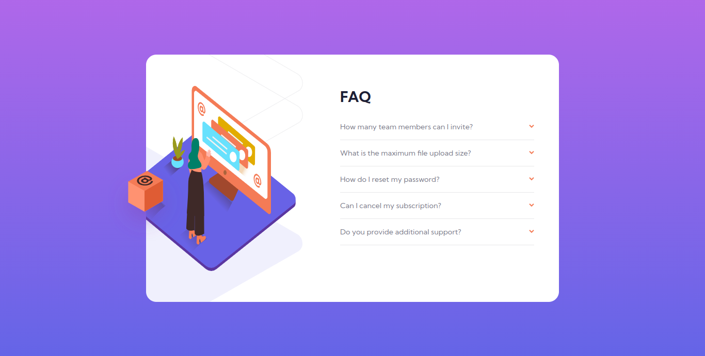
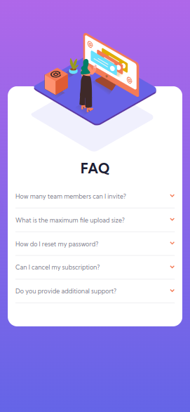

# Frontend Mentor - FAQ accordion card solution

This is a solution to the [FAQ accordion card challenge on Frontend Mentor](https://www.frontendmentor.io/challenges/faq-accordion-card-XlyjD0Oam). Frontend Mentor challenges help you improve your coding skills by building realistic projects.

## Table of contents

- [Overview](#overview)
  - [The challenge](#the-challenge)
  - [Screenshot](#screenshot)
  - [Links](#links)
  - [Built with](#built-with)
- [Author](#author)

## Overview

### The challenge

Users should be able to:

- View the optimal layout for the component depending on their device's screen size
- See hover states for all interactive elements on the page
- Hide/Show the answer to a question when the question is clicked

### Screenshot

### Links

- Solution URL: [Add solution URL here](https://github.com/aviralsharma07/faq-accordian-card)
- Live Site URL: [Add live site URL here](https://faq-accordian-card-avi.netlify.app)

### Built with

- Semantic HTML5 markup
- CSS custom properties
- Flexbox

## Author

- Blogs - [Add your name here](https://hashnode.com/@aviralsharma)
- Frontend Mentor - [aviralsharma07](https://www.frontendmentor.io/profile/aviralsharma07)
- Twitter - [\_aviral07](https://www.twitter.com/_aviral07)
